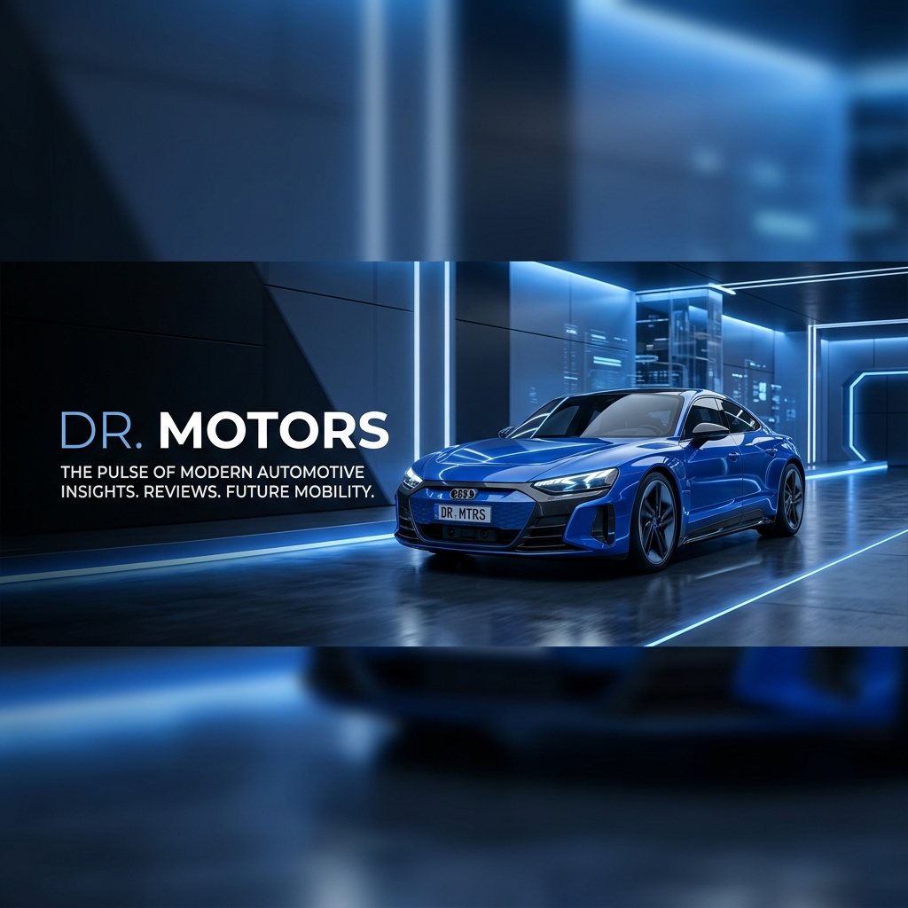

## 🏎️ "당신의 카 라이프를 위한 가장 스마트한 네비게이션"

급변하는 자동차 시장, 매일같이 쏟아지는 신차 소식과 복잡한 기술 용어들 사이에서 방황하고 계신가요? 
**닥터모터스(Dr. Motors)**는 전문가의 시선으로 복잡한 자동차 정보를 분석하고, 운전자에게 꼭 필요한 알짜 정보만을 골라 전달해 드립니다.

우리는 단순한 스펙 나열이 아닌, 자동차가 우리의 삶에 주는 가치와 실질적인 주행 경험, 그리고 현명한 유지관리 방법까지 폭넓게 다룹니다.

---

## 🧭 닥터모터스가 다루는 핵심 분야

### 1. 신차 분석 & 시승기 (New Car Review)
단순한 홍보 자료가 아닌, 실체적인 주행 성능과 공간 활용성, 그리고 가격 대비 가치를 집요하게 분석합니다.

### 2. 자동차 기술 & 트렌드 (Tech & Trends)
내연기관에서 전기차(EV), 자율주행으로 넘어가는 거대한 변혁의 흐름을 이해하기 쉽게 풀어냅니다.

### 3. 스마트한 관리 팁 (Maintenance Tips)
내 차의 수명을 늘리고 유지비를 줄이는 정비 꿀팁부터 디테일링 노하우까지 전수합니다.

### 4. 자동차 라이프스타일 (Car Lifestyle)
차와 함께하는 캠핑, 여행, 그리고 자동차가 선사하는 즐거운 일상을 기록합니다.

---

## 🎯 우리의 약속 (Promise)

- **정확함(Accuracy)**: 검증된 팩트만을 전달합니다.
- **쉬움(Simplicity)**: 어려운 자동차 공학 용어도 누구나 이해할 수 있게 설명합니다.
- **유용함(Utility)**: 독자의 실제 카 라이프에 도움되는 실무적인 팁을 제공합니다.

---

## 🏁 함께 달리는 공간

닥터모터스는 자동차를 사랑하는 모든 분과 소통하며 성장하고 싶습니다. 
이곳의 기록들이 여러분의 다음 차 선택이나, 현재 타고 계신 차와의 소중한 동행에 든든한 가이드가 되기를 바랍니다.

질문이나 시승 요청, 자동차 관련 고민이 있다면 언제든 환영합니다! 
**닥터모터스**가 여러분의 가장 든든한 조력자가 되어드리겠습니다.

> **"더 나은 이동이 더 나은 삶을 만듭니다."**
